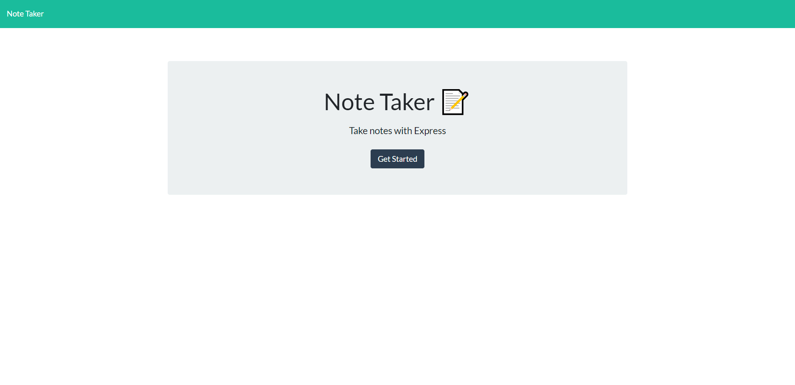
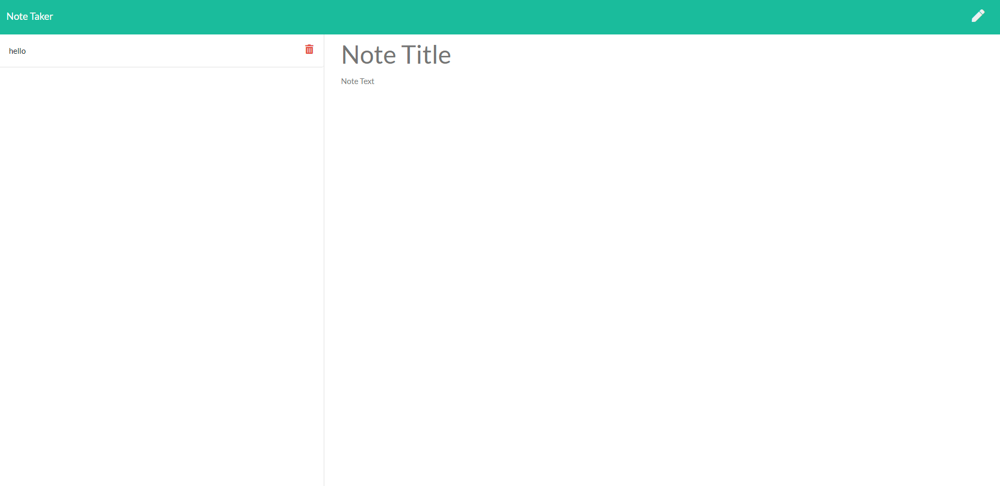

# Note Taker  
  
  
  
  
  
  
  

  

  [Link to webpage](https://salty-gorge-35909.herokuapp.com/)
  
  As a user, I want to be able to write and save Notes, i want to be able to deletes notes I've written before, So that i can organize my thoughts and keep track of task i need to complete  
    
  ## Table of Content
  [-Installation](#Installation)  
  [-Description](#Description)    
  [-Usage](#Usage)  
  [-Contributors](#Contributors)  
  [-Test](#Test)  
  [-Questions](#Questions)  
  
  
  ## Installation  
  To make this project run on their server/local host. The user needs to download the project, run "npm i" in terminal where your download is, then write "node server.js" to run server locally. 

  ## Description  
  Its a notepad/todo list where you can enter in notes and save them in the server. It stores the name and whatever text you enter in. Also you will have to add and delete notes easily.

  ## Usage  
  Can be used by everyone that needs to be able to track information, or organize the users tasks and thoughts.

  
  
  ## Questions?  
  
    My Github link is [Nvrtis](https://github.com/Nvrtis)
    Any futher questions can be sent to my email here  <Nvav91@gmail.com>
